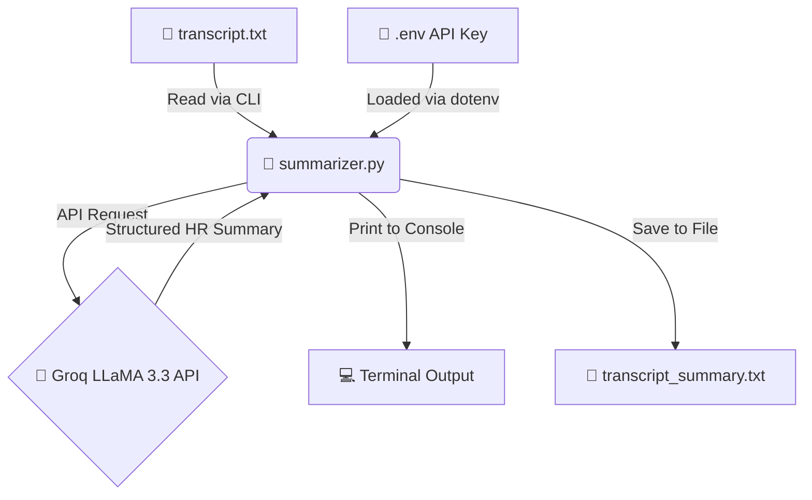

# 🎙️ Interview Transcript Summarizer

A lightweight Python tool that reads an interview transcript (`.txt`) and produces a structured HR summary using **Groq** (LLaMA 3.3).

---

## 🤖 Model Used

| Field      | Value                    |
|------------|--------------------------|
| Provider   | Groq                     |
| Model ID   | `llama-3.3-70b-versatile`|
| Purpose    | Interview transcript summarization |

---

## 🏗️ Architecture



---

## ⚙️ Prerequisites

- Python 3.8 or higher
- A valid [Groq API key](https://console.groq.com/keys)

---

## 🚀 Installation

Install the required packages:

```bash
pip install groq python-dotenv
```

---

## 🔑 .env Setup

Create a file named `.env` in the same directory as `summarizer.py`:

```
GROQ_API_KEY=your_groq_api_key_here
```

> ⚠️ **Never commit your `.env` file to version control.** It is already listed in `.gitignore`.

---

## 💻 Usage

```bash
python summarizer.py <filename.txt>
```

**Example:**

```bash
python summarizer.py transcript.txt
```

### 🔍 What happens:

1. 📂 The transcript is read from the provided `.txt` file.
2. 🚀 The content is sent to the Groq API (LLaMA 3.3) with an HR analyst prompt.
3. 💬 A structured summary is printed to the terminal.
4. 💾 The summary is also saved as `transcript_summary.txt` in the current directory.

---

## 📋 Output Format

The generated summary always contains exactly three sections:

```
## 1. Topics Covered
- ...

## 2. Candidate Profile
Role — Seniority level
Justification...

## 3. Candidate Summary
Short paragraph...
```

---

## 🛑 Error Handling

| Scenario                        | Behavior                                      |
|---------------------------------|-----------------------------------------------|
| Missing transcript file         | Prints a clear error message and exits        |
| Empty transcript file           | Prints a clear error message and exits        |
| Missing `GROQ_API_KEY`          | Prints setup instructions and exits           |
| Groq API failure                | Prints the API error message and exits        |

---

## 📁 Project Structure

```text
Interview-Summarizer/
├── summarizer.py          # 🐍 Main script
├── .env                   # 🔑 API key (not committed)
├── .gitignore             # 🚫 Excludes .env
└── README.md              # 📖 This file
```
